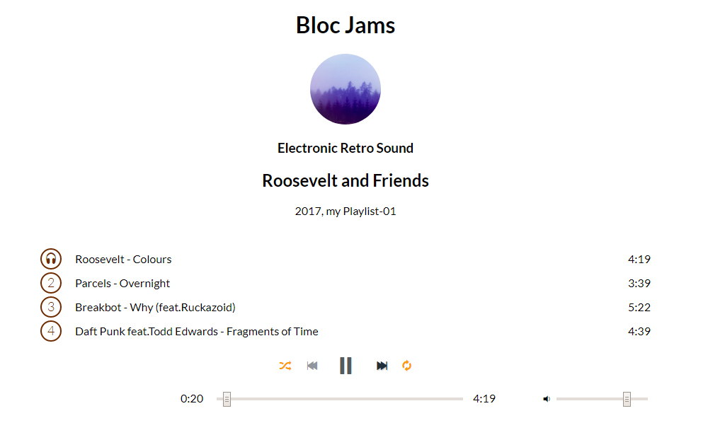

# Dj Tatuu Music Player
A Front-end development project base on HTML5, CSS3 and Javascript with ReactJS framework. Dj Tatuu Music Player is replica of famous music streaming application like Spotify, contain basic music player abilities. Users can select music albums, play/pause songs in the playlist and also skip next/previous song by using player bar at the bottom of the page.

*Note: This is one of the student projects with [Bloc Inc.](https://www.bloc.io/)*

## Collection
DJ Tatuu Music Player ReactJS is one of three developed projects, using different frameworks and library consist of:
- [DJ Tatuu JQuery](https://github.com/bakhumhlea/dj-Tatuu-jquery)
- [DJ Tatuu AngularJS](https://github.com/bakhumhlea/dj-Tatuu-AngularJS) and
- This DJ Tatuu ReactJS

## Screenshot

## Version
v0.01

## Demo
This project is undeployed.
